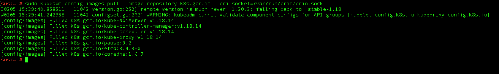
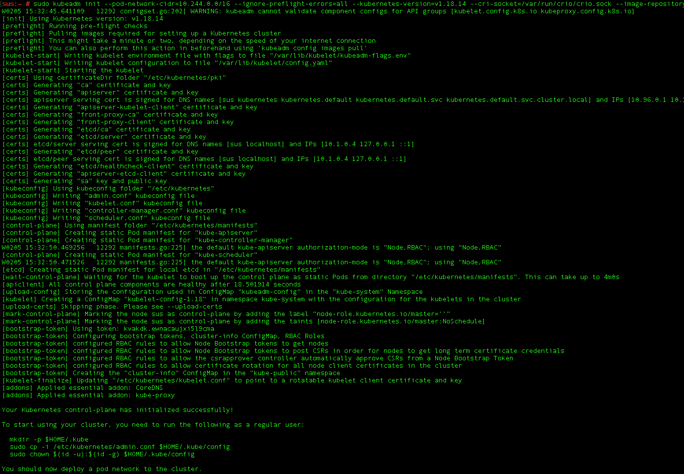
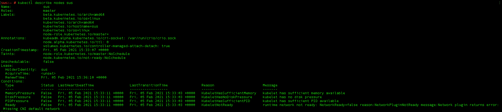
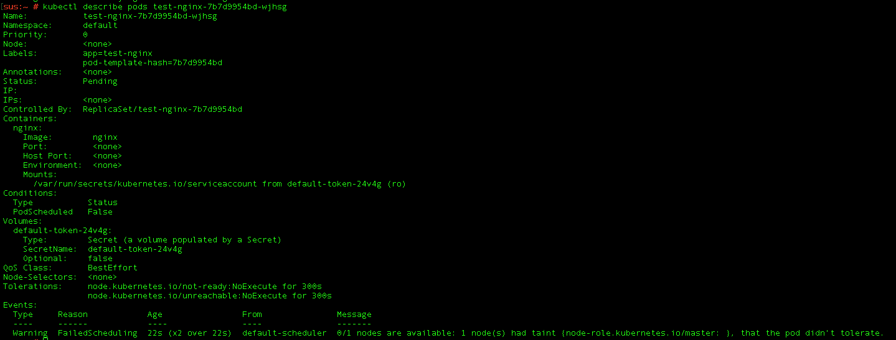

# Kubernetes v1.18 on Suse Linux v15:  

Kubernetes is built to run natively in the linux operating system. As there are many flavors of enterprise and open source linux offerings it is hard to have all flavors of linux fully support Kubernetes and the surrounding tools to provision a cluster. One distribution of linux that is rather popular is SUSE linux, despite its popularity there aren't any direct ways shown on how to install vanilla Kubernetes in SUSE linux but since it is a linux distribution we will try and figure out how to provision a Kubernetes cluster using SUSE virtual machines. 
 
## Setting up the Linux System
Create a virtual machine with Suse Linux v15 on azure or any cloud provider. The os disk you use does not necessarily matter. For mine I am using standard ssd. The virtual machine size is not too particular, anything with a few vcpus and 4GIB’s of memory or more. Once the machine is started up ssh into it and begin installing the dependencies we need for the installing Kubernetes – in this case we have the option of either using Kubespray, Kubeadm, kops or a few other Kubernetes bootstrapping options. For the following I am going to be using Kubeadm since that is the standard way to provision a Kubernetes cluster.  
## Setting up Kubeadm and other k8s installation tools on Suse
Per the Kubeadm documentation found [here](https://kubernetes.io/docs/setup/production-environment/tools/kubeadm/install-kubeadm/), it does not appear that Kubeadm is supported in Suse Linux. Luckily, after some digging it appears there is a Zypper package that we can download called “kubernetes-kubeadm” which includes docker, Kubelet and the other dependencies that we need for doing a Kubeadm install of a Kubernetes cluster.  


Before we run our `zypper install kubernetes-kubeadm` command we need to set up a few things to get docker installed. So, first run `zypper addrepo http://download.opensuse.org/distribution/leap/15.2/repo/oss/ public` which adds the oss repo for software installation. Note: we are going to agree to always trust the key that it generates. Then in order to install symbols required by we will run `docker zypper install libseccomp-devel` and `swapoff -a` to turn off all swap partitions. Then we can run Zypper install kubernetes-kubeadm. When we run the installation command for kubernetes-kubeadm docker, crio, kubelet and kubeadm are all installed.  
 

From there we need to start the docker and Kubelet services in order for us to be able to provision our cluster. We can do this by running: 

```bash 
# start docker service
systemctl start docker.service  
systemctl enable docker.service 
# start kubelet service  
systemctl start kubelet.service  
systemctl enable kubelet.service

```

## Provision our cluster 
For Kubernetes clusters there are a few container images that are always needed, these images make up the incremental building blocks that allow Kubernetes to run as specified. Depending on your Kubernetes cluster you may have a few different pods but generally you will have an etcd pod, coredns pod, kube-controller-manager pod, kube-apiserver pod, kube-scheduler pod, pause pod and kube-proxy pod respectively. 



There are a few flavors of said images including Suse built and maintained flavors. When we try and pull the images maintained by Suse we run into errors that our manifests for those images do not exist. I tried pulling the same images but from a different repository instead – namely the gcr.k8s.io one, which happens to be the vanilla Kubernetes distribution one - which proved successful. At the moment there is nothing that really indicates why we can’t pull the suse maintained images for our Kubernetes, simply that the manifest wasn’t recognized but since Kubernetes uses linux based control-plane images it doesn't matter which control-plane base images we use. 

So, to incorporate this fix in creating our cluster we will specify that we are wanting to use those specific images by using the `–-image-repository` flag in our Kubeadm Init command. Another fix that we will need to do is list which container runtime we will want to use – we will have two made available to us from the above install command, either Dockershim or Crio.  

We can specify this by using the `--cri-socket` flag and for our case we are going to use the Crio runtime so we will map the following path - `/var/run/crio/crio.sock`. We do have the option of using docker’s container runtime called dockershim, but that will be deprecated from Kubernetes v1.20 on so we are better off using a more cloud native container runtime like Crio. Now that we are talking about container runtimes, I’d like to break down the concept of containers versus container runtimes as there is often confusion about this topic. Contrary to what may be assumed, a container and a container runtime are not the same thing. A container runtime is responsible for all the parts of running a container that isn’t actually running the program itself. So, for Kubernetes there are a few options for container runtimes, the thing that actually runs our containers in our cluster. For more information on container runtimes that are natively supported by the Kubernetes ecosystem, check out this [documentation](https://kubernetes.io/docs/setup/production-environment/container-runtimes/).  


With this figured out and our dependencies all installed we can now run the following to pull our configuration images for Kubeadm – `sudo kubeadm config pull –image-repository k8s.gcr.io --cri-socket=/var/run/crio/crio.sock`. This will pull the images we need for bootstrapping our Kubernetes cluster – ie etcd, kubeproxy, coredns etc. Now that we have our images pulled, we can initiate our cluster by running: `sudo kubeadm init –pod-network-cidr=10.244.0.0/16 --ignore-preflight-errors=all –kubernetes-version=all –cri-socket=/var/run/crio/crio.sock --image-repository k8s.gcr.io`  



This will take a few minutes to provision but after we have run the above command to set up our cluster, we now need to create a `.kube` directory and import the created credential files to that directory so that we can connect to the cluster that we have just created. We do that by running: 

```bash 
mkdir -p /Users/jabras/.kube  

sudo cp -I /etc/kubernetes/admin.conf /Users/jabras/.kube/config  

sudo chown : /Users/jabras/.kube/config  


#After this we need to install our kubectl client for our desired version of kubectl (v1.18.14). Which we can do by running:  


curl -LO https://dl.k8s.io/release/v1.18.14/bin/linux/amd64/kubectl 

sudo install -o root -g root -m 0755 kubectl /usr/local/bin/kubectl  

#check version we installed  

kubectl version –client
```
## Post install fixes

After we have downloaded the cli we can check to see if we are properly connected to our cluster. We can do this by running `kubectl get nodes`. This will show that we have one node available and that the node's state is "NotReady". This is because we need to apply a cluster networking solution for our Kubelet, which we could figure out by looking at the output under the "CONDITIONS" portion of the `kubectl describe pods` output as shown below. 



We will use flannel for our cluster networking solution. That can be done by running `kubectl apply –f https://raw.githubusercontent.com/coreos/flannel/master/Documentation/kube-flannel.yaml` To check that we now have cluster networking for our kubelet configured we can simply run `kubectl get nodes` and inspect the status of our master node to see if the node status is now set to "Ready" or "NotReady". Note: the cluster networking solution that we have implemented may take a moment or two to connect and configure properly.  

With our node ready and healthy we can now test out whether we can run any containers in our cluster besides the control-plane containers. We will create a simple deployment of nginx by running `kubectl create deployment nginx-test –-image=nginx`. Once this has completed we can check to see the status of our pods for this deployment by running `kubectl get pods`. For which we will see that we are unable to create the container. To troubleshoot this we can run `kubectl describe pod <nginx-test-pod-identifier>` which will show us that there is a taint on the master node that doesn’t allow non control-plane pods to be scheduled on the master node. 



So for the purposes of testing whether we can run a deployment in our cluster we will remove that taint by running `kubectl taint nodes –all node-role.kubernets.io/master-` and we can now see that our deployment is running properly now. Note: This obviously won't be a problem in a multi node cluster since we will have multiple nodes for this deployment to be scheduled onto.  

BONUS: Since we will also want kustomize for our cluster we can install version 3.7 of it by using this script - https://raw.githubusercontent.com/kubernetes-sigs/kustomize/master/hack/install_kustomize.sh. Once we have Kustomize version 3.7 installed we can use it to run another test cluster. 

## Conclusion

As we can see, although the task at first may seem hard to get working, since kubernetes is built to run on linux we can in fact deploy a working kubernetes cluster successfully on a standard Suse linux distribution. This will allow us to not have to worry about using opensuse or any other kubernetes plugin solution for suse or other non production grade solution. It will also allow us to be able to build our own custom built Kubernetes cluster if we want and from there build and deploy whatever application we want on top of that cluster. 


Up next I will tie this all together to show how you can streamline the above process to create a multi node cluster as well as how to set up a Viya 4 deployment on said cluster using Suse Linux. 